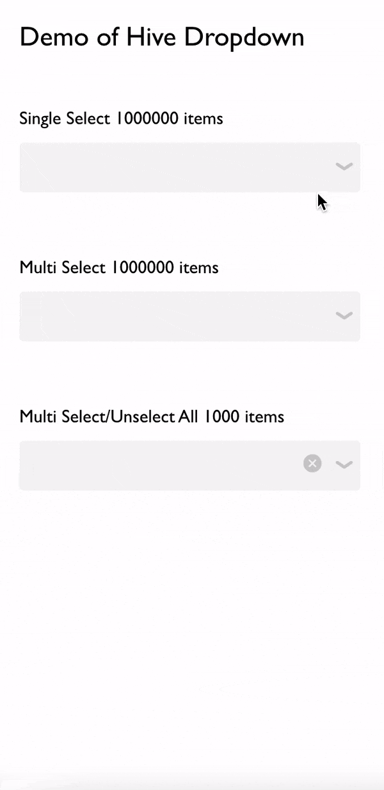

# Hive Dropdown Demo

Frontend Hive challenge to build a dropdown in React and/or vanilla Java
This demo was built using create-react-app boilerplate.

## Pre-Req
[npm](https://www.npmjs.com/) (used 7.20.5)
[node](https://nodejs.org/en/) (used v14.17.4)

## Preview



### 1. Setup
```bash
npm install
```

### 2. Run Demo
```bash
npm start
```

## Usage of Component
```jsx
import HiveOptimizedDropdown from './components/HiveOptimizedDropdown';

const options = [{value: 'option1', value: 'option2', value: 'option3'}];

...

// In render function
<HiveOptimizedDropdown showsSelectAll={true} showsClearSelection={true}isMultiSelect={true} options={options} onChange={(data) => console.log(data)} />
```

## Component Props
| Prop | Type | Description | 
| :---: | :---: | :---: | 
| showsSelectAll | boolean | ability to have a select-all items button. Only works when 'isMultiSelect' prop is also true. | 
| isMultiSelect | boolean | ability to select multiple items. | 
| showsClearSelection | boolean | ability to have a clear selection button at the right side of the dropdown (appears as an x icon). | 
| options | Array\<Object\> | The items displayed as selectable options in the dropdown. Each item in the array atleast have {value: \<String\>}. Values should be unique. |
| onChange | function | callback that gives data as parameter. Triggers whenever user makes a selection, clears a selection, selects all. | 

## Supported Features

| Feature | Optimized | Unoptimized |
| :---: | :---: | :---: | 
| Open/Close State | :white_check_mark: | :white_check_mark: |
| Select / Deselect | :white_check_mark: | :white_check_mark: |
| Select All | | :white_check_mark: | :white_check_mark: | 
| Unselect All | :white_check_mark: | :white_check_mark: | 
| Multi Select | :white_check_mark: | :white_check_mark: |
| Autoscroll to chip | Only Strings  | :white_check_mark: |
| Initialization of selected |  | :white_check_mark: |
| Lazy Render (fast performance for 1mill rows) | :white_check_mark: |  |

## Notes
For normal use-cases of around ~100 items dropdown, a simple list that is completely rendered would suffice. Wasn't sure which one was needed so I tried implementing both.

I took the approach of a virtualized list for most efficiency but they are difficult to work with due to constraints of needing very specific sizing. This also has a negative trade-off with the extensibility and readability of the code of the actual virtualized list.

The current virtualized list can generate a list of 1000000+ selectable items without lag as shown in the demo.

But this would still be slow for a select-all button because the best-conceivable-runtime is O(n), where it has to go through atleast n number of items to either make or modify them to be true for a proper returned the output. The alternative to make this usable at 1million items is to use a single boolean flag for indicating all selected (less elegant solution and output would be a flag too). For the optimized list, there is some noticable lag for the select-all button that occurs at 10000+ items but it is unnoticeable at 1000 items. The time and scaling for both optimized and unoptimized versions are around the same for select-all.

Another trade-off was made to improve efficiency. Initialization of selected options is not possible (it also wasn’t listed as a  component requirement). If initialization is required, it would be better to utilize an array but I opted for a map in the optimized version. An array would gurantee the ordering of selection. This trade-off was made for efficiency again. Using an object key-value map to store the selected values (no false values) instead of an array so that initialization, clearing, and referencing of specific values is O(1). This allows speedier response from creation of the elements, clearing items, and selecting items. But this also removes ordering for insertion of non-String keys, so selecting items may not look nice when appended to the dropdown bar. E.g. an object stores integer keys in ascending order which means an autoscroll feature on select would not work.

- Uncomment onChange props in App.js to see console.log of output
-  I opted not to allow for duplicate labels because it would be weird to use a dropdown to select multiple duplicate labels. But if there ever is a case, it could be pretty easy to modify the code to allow for it. The input stores an array of objects which allows for more data to be passed to the dropdown. An id can be included in this object to allow for the duplicate labels, since the dropdown already uses a map to track selected states.
